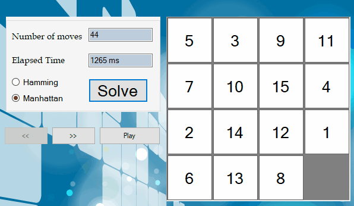

# N-Puzzle
Solves N-Puzzle problem of any size using algorithms, data structures and heuristics.


## Introduction
The N-puzzle (N = 8, 15...) is a classical problem for modeling algorithms involving heuristics. Commonly used heuristics for this problem
 include counting the number of misplaced tiles (Hamming Distance) or finding the sum of the Manhattan distances between each block and its position
 in the goal configuration. Note that both are admissible, i.e. they never overestimate the number of moves left, which ensures optimality 
for certain search algorithms such as A*. A* is one of the informed search algorithms that can be used in such problems to get 
the optimal solution. 
## Goal
1. First, detect whether the board is solvable or not. If not solvable, then no feasible solution for the given puzzle.
2. If solvable, then your objective is to get the shortest path to get the final solution from the initial board using heuristics (Hamming or Manhattan)
and using A* as a search algorithm.
3. Display the shortest path using an animation of the solution either step by step or play all the steps.
## Used Data Structures
- Priority Queue 
- Dictionary
- Stacks for navigating back and forth on the solution
## How to use?
The puzzle to solve should be in a file where:
- First line is a number indicating the size of a puzzle (N).  
- The description is just a list of the tiles in their initial positions, with the rows listed from top to bottom, and the tiles listed from left to right within a row, where the tiles are represented by numbers 1 to N2 - 1, plus '0' which is equivalent to the blank space.

An example for this:
```
3

7 3 2
5 0 6
1 8 4
```
